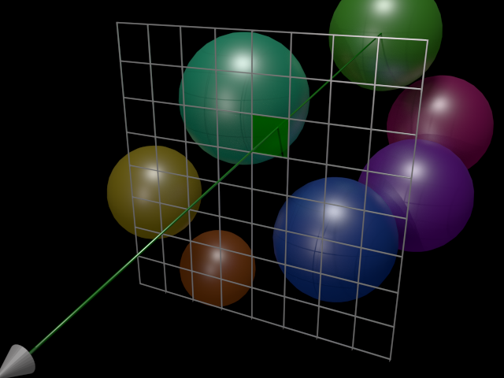

# demo-raytracing-no-webgl
How to fly among hundreds of 3d spheres drawn on a 2D canvas in pure JS without WebGL nor ASM.

[Launch the demo](http://tolokoban.github.io/demo-raytracing-no-webgl/)!

## How it works?

All the logic is done in the class `painter` of the file [`ray.painter.js`](https://github.com/tolokoban/demo-raytracing-no-webgl/blob/gh-pages/js/ray.painter.js).

The above image is a good illustration of how ray-tracing works. Just place a screen in front of a camera and cast a light's ray through each pixel. If this ray hits a sphere, you can determine the pixel's color by looking at the angle of incidence for that collision. To get more realism, you can make the ray bounce until it reaches a light source or dies in the darkness.

You can see at the [WebGL version of this demo](https://github.com/tolokoban/demo-raytracing-shader), which is much faster!
